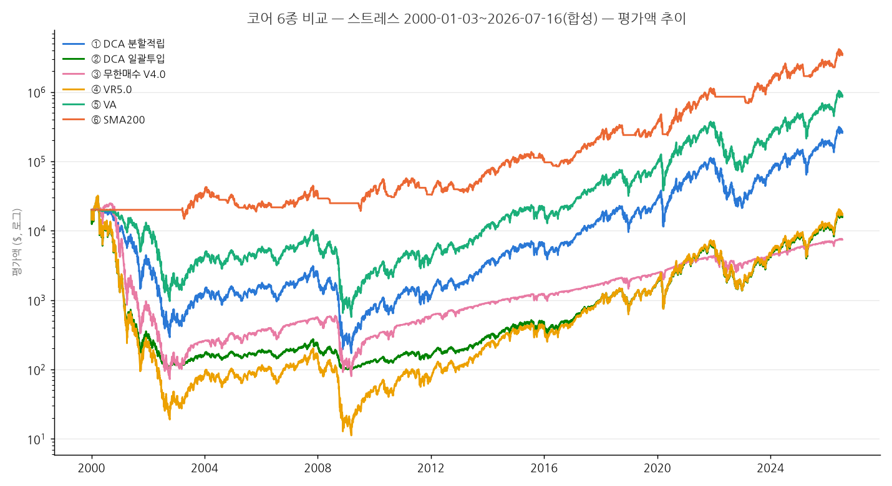
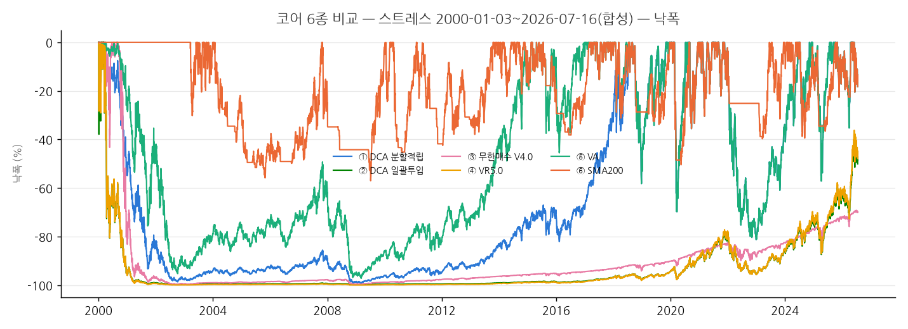

# 코어 6종 비교 — 스트레스 2000-01-03~2026-07-16(합성)

## 시나리오 B — 스트레스 테스트 (2000-01-03 ~ 2026-07-16, 합성 TQQQ, 각 $20,000)

- TQQQ_SYNTH_2.0 = 3×QQQ 총수익률(배당재투자 포함) − drag 2.0%/년, synth.py로 생성.
  2010-02-11 TQQQ 상장 이전 구간(닷컴버블 붕괴 -83%, 2008 금융위기 포함)까지 확장해
  실측으로는 볼 수 없는 초장기 하락장에서의 생존성을 본다.
- 합성 시계열의 OHLC는 open=high=low=close로 단일화되어 있다(synth.py — 일중 변동을
  모델링하지 않음). LOC/MOC/SMA 판정은 원래 종가 기준이라 이 단일화의 영향이 없지만,
  무한매수법의 최종매도(지정가, LIMIT)는 정규장 고저 범위로 판정하므로 실제보다
  체결이 보수적으로(늦게) 일어난다 — 전략별 비고에 명시.
- HFEA는 제외했다(합성 UPRO/TMF 시계열이 없음 — synth.py는 QQQ 기반 TQQQ만 합성).

- 세후 계산: 연도별 실현손익 − 공제 $1851.85(250만원/1350원 고정환율) 초과분 22%, 손실 이월 없음
- 수수료: 체결금액의 0.07% (KIS 우대 가정, broker_sim 기본값)

| 전략 | CAGR(세전) | CAGR(세후) | MDD | 연변동성 | Sharpe | 평균현금비중 | 연평균매매 | 최종평가액 | 비고 |
|---|---|---|---|---|---|---|---|---|---|
| ① DCA 분할적립 | 10.11% | 10.11% | -99.20% | 69.38% | 0.49 | 3.94% | 22 | $257,465 | 합성 시계열(drag 2.0%), 닷컴버블 -83% 구간 포함 |
| ② DCA 일괄투입 | -0.91% | -0.91% | -99.69% | 62.41% | 0.30 | 29.33% | 1 | $15,664 | 합성 시계열(drag 2.0%), 닷컴버블 -83% 구간 포함 |
| ③ 무한매수 V4.0 | -3.66% | -3.66% | -99.71% | 56.52% | 0.22 | 56.89% | 408 | $7,433 | 합성 시계열(drag 2.0%), 닷컴버블 -83% 구간 포함; 합성 OHLC가 open=high=low=close라 최종매도(지정가)가 실제보다 보수적으로(늦게) 체결됨 — 장중 변동 미반영, LOC/MOC는 원래 종가 기준이라 영향 없음 |
| ④ VR5.0 | -0.66% | -0.66% | -99.97% | 80.00% | 0.39 | 0.13% | 4 | $16,752 | 합성 시계열(drag 2.0%), 닷컴버블 -83% 구간 포함 |
| ⑤ VA | 15.20% | 15.20% | -97.20% | 67.84% | 0.55 | 5.26% | 9 | $854,591 | 합성 시계열(drag 2.0%), 닷컴버블 -83% 구간 포함 |
| ⑥ SMA200 | 21.36% | 20.63% | -56.98% | 40.74% | 0.68 | 35.33% | 8 | $3,403,366 | 합성 시계열(drag 2.0%), 닷컴버블 -83% 구간 포함; SMA/밴드 판정은 원래 종가 기준이라 합성 OHLC 단일화의 영향 없음, 단 데이터가 2000-01-03부터 시작해 앞 200거래일은 워밍업(무매매) 구간 |

## 최악 낙폭 구간 (전략별 상위 5)

### ① DCA 분할적립
- {'peak_date': datetime.date(2000, 3, 24), 'trough_date': datetime.date(2009, 3, 9), 'recovery_date': datetime.date(2018, 7, 25), 'drawdown_pct': -0.9920312571965856, 'duration_days': 3272}
- {'peak_date': datetime.date(2021, 11, 19), 'trough_date': datetime.date(2022, 12, 28), 'recovery_date': datetime.date(2024, 6, 14), 'drawdown_pct': -0.8121579140083501, 'duration_days': 404}
- {'peak_date': datetime.date(2020, 2, 19), 'trough_date': datetime.date(2020, 3, 23), 'recovery_date': datetime.date(2020, 7, 10), 'drawdown_pct': -0.6971577119928638, 'duration_days': 33}
- {'peak_date': datetime.date(2018, 8, 29), 'trough_date': datetime.date(2018, 12, 24), 'recovery_date': datetime.date(2019, 11, 1), 'drawdown_pct': -0.581916445193355, 'duration_days': 117}
- {'peak_date': datetime.date(2024, 12, 16), 'trough_date': datetime.date(2025, 4, 8), 'recovery_date': datetime.date(2025, 7, 25), 'drawdown_pct': -0.5711509782185443, 'duration_days': 113}

### ② DCA 일괄투입
- {'peak_date': datetime.date(2000, 3, 24), 'trough_date': datetime.date(2009, 3, 9), 'recovery_date': None, 'drawdown_pct': -0.9969263656608016, 'duration_days': 3272}
- {'peak_date': datetime.date(2000, 1, 3), 'trough_date': datetime.date(2000, 1, 6), 'recovery_date': datetime.date(2000, 2, 8), 'drawdown_pct': -0.3785711046442183, 'duration_days': 3}
- {'peak_date': datetime.date(2000, 3, 9), 'trough_date': datetime.date(2000, 3, 15), 'recovery_date': datetime.date(2000, 3, 23), 'drawdown_pct': -0.2910724071839201, 'duration_days': 6}
- {'peak_date': datetime.date(2000, 2, 10), 'trough_date': datetime.date(2000, 2, 22), 'recovery_date': datetime.date(2000, 2, 23), 'drawdown_pct': -0.11054125981504645, 'duration_days': 12}
- {'peak_date': datetime.date(2000, 2, 24), 'trough_date': datetime.date(2000, 2, 28), 'recovery_date': datetime.date(2000, 3, 1), 'drawdown_pct': -0.08704398693665184, 'duration_days': 4}

### ③ 무한매수 V4.0
- {'peak_date': datetime.date(2000, 9, 1), 'trough_date': datetime.date(2002, 10, 9), 'recovery_date': None, 'drawdown_pct': -0.9970832712703129, 'duration_days': 768}
- {'peak_date': datetime.date(2000, 3, 23), 'trough_date': datetime.date(2000, 5, 23), 'recovery_date': datetime.date(2000, 6, 19), 'drawdown_pct': -0.43274790915231237, 'duration_days': 61}
- {'peak_date': datetime.date(2000, 7, 20), 'trough_date': datetime.date(2000, 7, 28), 'recovery_date': datetime.date(2000, 8, 17), 'drawdown_pct': -0.060190919655734525, 'duration_days': 8}
- {'peak_date': datetime.date(2000, 6, 21), 'trough_date': datetime.date(2000, 7, 5), 'recovery_date': datetime.date(2000, 7, 12), 'drawdown_pct': -0.053030804269745956, 'duration_days': 14}
- {'peak_date': datetime.date(2000, 1, 21), 'trough_date': datetime.date(2000, 1, 28), 'recovery_date': datetime.date(2000, 2, 2), 'drawdown_pct': -0.029272419405192027, 'duration_days': 7}

### ④ VR5.0
- {'peak_date': datetime.date(2000, 3, 24), 'trough_date': datetime.date(2009, 3, 9), 'recovery_date': None, 'drawdown_pct': -0.9996514821601074, 'duration_days': 3272}
- {'peak_date': datetime.date(2000, 1, 3), 'trough_date': datetime.date(2000, 1, 28), 'recovery_date': datetime.date(2000, 2, 7), 'drawdown_pct': -0.29062372681743953, 'duration_days': 25}
- {'peak_date': datetime.date(2000, 3, 9), 'trough_date': datetime.date(2000, 3, 15), 'recovery_date': datetime.date(2000, 3, 23), 'drawdown_pct': -0.28845447384528894, 'duration_days': 6}
- {'peak_date': datetime.date(2000, 2, 10), 'trough_date': datetime.date(2000, 2, 22), 'recovery_date': datetime.date(2000, 2, 23), 'drawdown_pct': -0.10919528665499018, 'duration_days': 12}
- {'peak_date': datetime.date(2000, 2, 24), 'trough_date': datetime.date(2000, 2, 28), 'recovery_date': datetime.date(2000, 3, 1), 'drawdown_pct': -0.08609526435650822, 'duration_days': 4}

### ⑤ VA
- {'peak_date': datetime.date(2000, 9, 1), 'trough_date': datetime.date(2009, 3, 9), 'recovery_date': datetime.date(2015, 2, 19), 'drawdown_pct': -0.9719991383020764, 'duration_days': 3111}
- {'peak_date': datetime.date(2021, 11, 19), 'trough_date': datetime.date(2022, 12, 28), 'recovery_date': datetime.date(2024, 6, 14), 'drawdown_pct': -0.8121578973983942, 'duration_days': 404}
- {'peak_date': datetime.date(2020, 2, 19), 'trough_date': datetime.date(2020, 3, 23), 'recovery_date': datetime.date(2020, 7, 10), 'drawdown_pct': -0.6971576697109503, 'duration_days': 33}
- {'peak_date': datetime.date(2018, 8, 29), 'trough_date': datetime.date(2018, 12, 24), 'recovery_date': datetime.date(2019, 11, 1), 'drawdown_pct': -0.5819163863772031, 'duration_days': 117}
- {'peak_date': datetime.date(2024, 12, 16), 'trough_date': datetime.date(2025, 4, 8), 'recovery_date': datetime.date(2025, 7, 25), 'drawdown_pct': -0.5711509694011189, 'duration_days': 113}

### ⑥ SMA200
- {'peak_date': datetime.date(2007, 10, 31), 'trough_date': datetime.date(2009, 7, 7), 'recovery_date': datetime.date(2010, 3, 10), 'drawdown_pct': -0.569810732923012, 'duration_days': 615}
- {'peak_date': datetime.date(2004, 1, 26), 'trough_date': datetime.date(2005, 10, 28), 'recovery_date': datetime.date(2007, 10, 23), 'drawdown_pct': -0.5583180208750235, 'duration_days': 641}
- {'peak_date': datetime.date(2020, 2, 19), 'trough_date': datetime.date(2020, 5, 14), 'recovery_date': datetime.date(2020, 8, 25), 'drawdown_pct': -0.5043204007875661, 'duration_days': 85}
- {'peak_date': datetime.date(2010, 4, 23), 'trough_date': datetime.date(2010, 9, 13), 'recovery_date': datetime.date(2011, 2, 11), 'drawdown_pct': -0.45237059252307643, 'duration_days': 143}
- {'peak_date': datetime.date(2011, 2, 16), 'trough_date': datetime.date(2012, 1, 13), 'recovery_date': datetime.date(2013, 10, 16), 'drawdown_pct': -0.424755740529486, 'duration_days': 331}
