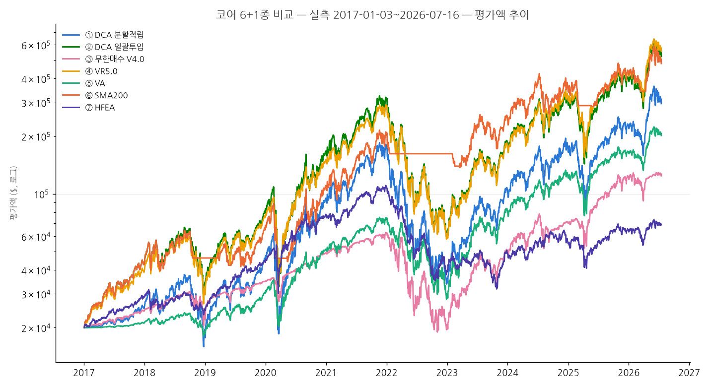
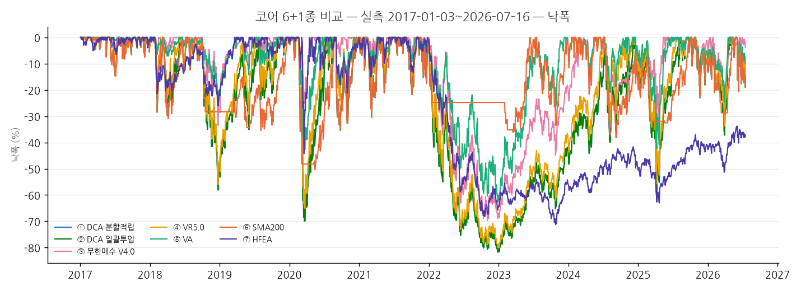

# 코어 6+1종 비교 — 실측 2017-01-03~2026-07-16

## 시나리오 A — 실측 데이터 (2017-01-03 ~ 2026-07-16, 각 $20,000)

- TQQQ/UPRO/TMF 실측 종가(GOOGLEFINANCE, 배당 미조정 — data/META.md 참고).
- 시작일을 2010년 상장 직후가 아니라 2017-01-03으로 잡은 것은 저가(<$10) 구간의
  낮은 정밀도(META.md 한계 2)를 피하고, UPRO/TMF/TQQQ가 모두 안정적으로 거래되는
  공통 구간으로 7종 전략을 동일 조건에서 비교하기 위함이다.
- 배당: TQQQ/UPRO는 배당이 미미해 영향 작음. TMF(장기채 ETF)는 배당수익률이
  유의미해 HFEA 결과가 과소평가된다(전략별 비고 참고).

- 세후 계산: 연도별 실현손익 − 공제 $1851.85(250만원/1350원 고정환율) 초과분 22%, 손실 이월 없음
- 수수료: 체결금액의 0.07% (KIS 우대 가정, broker_sim 기본값)

| 전략 | CAGR(세전) | CAGR(세후) | MDD | 연변동성 | Sharpe | 평균현금비중 | 연평균매매 | 최종평가액 | 비고 |
|---|---|---|---|---|---|---|---|---|---|
| ① DCA 분할적립 | 32.68% | 32.68% | -81.76% | 66.65% | 0.76 | 7.20% | 21 | $296,047 | 2주 $500 적립, 잔돈 유휴(A_IDLE) |
| ② DCA 일괄투입 | 40.81% | 40.81% | -81.76% | 67.64% | 0.85 | 0.00% | 1 | $521,639 | 시작일 1회 전액 매수 후 매수도 매도도 없음(순수 보유) |
| ③ 무한매수 V4.0 | 21.13% | 18.08% | -69.74% | 41.57% | 0.67 | 54.02% | 919 | $124,287 | 40분할, R=15%, 큰수 10% |
| ④ VR5.0 | 41.72% | 39.66% | -80.12% | 62.05% | 0.88 | 10.26% | 7 | $554,470 | band=0.15, G=10, pool_limit=0.75(적립식 기본값), 2주 평가 |
| ⑤ VA | 27.45% | 25.67% | -62.65% | 40.76% | 0.80 | 46.99% | 11 | $201,754 | C=$300, R=1%/월(≈21거래일), 매도 허용 |
| ⑥ SMA200 | 39.57% | 37.29% | -50.19% | 47.03% | 0.95 | 22.79% | 5 | $479,299 | band=0(단순 교차), 2010년 데이터로 워밍업 완료 상태에서 시작 |
| ⑦ HFEA | 13.88% | 12.19% | -71.21% | 33.09% | 0.56 | 0.24% | 8 | $68,981 | TMF 배당 누락, CAGR 연 2~4%p 과소 |

## 최악 낙폭 구간 (전략별 상위 5)

### ① DCA 분할적립
- {'peak_date': datetime.date(2021, 11, 19), 'trough_date': datetime.date(2022, 12, 28), 'recovery_date': datetime.date(2024, 12, 11), 'drawdown_pct': -0.8175647187448662, 'duration_days': 404}
- {'peak_date': datetime.date(2020, 2, 19), 'trough_date': datetime.date(2020, 3, 20), 'recovery_date': datetime.date(2020, 7, 10), 'drawdown_pct': -0.6991835961593565, 'duration_days': 30}
- {'peak_date': datetime.date(2024, 12, 16), 'trough_date': datetime.date(2025, 4, 8), 'recovery_date': datetime.date(2025, 8, 12), 'drawdown_pct': -0.5830644845286764, 'duration_days': 113}
- {'peak_date': datetime.date(2018, 8, 29), 'trough_date': datetime.date(2018, 12, 24), 'recovery_date': datetime.date(2019, 11, 4), 'drawdown_pct': -0.5805111637370968, 'duration_days': 117}
- {'peak_date': datetime.date(2025, 10, 29), 'trough_date': datetime.date(2026, 3, 30), 'recovery_date': datetime.date(2026, 4, 24), 'drawdown_pct': -0.3717455372504458, 'duration_days': 152}

### ② DCA 일괄투입
- {'peak_date': datetime.date(2021, 11, 19), 'trough_date': datetime.date(2022, 12, 28), 'recovery_date': datetime.date(2024, 12, 11), 'drawdown_pct': -0.817559858875587, 'duration_days': 404}
- {'peak_date': datetime.date(2020, 2, 19), 'trough_date': datetime.date(2020, 3, 20), 'recovery_date': datetime.date(2020, 7, 10), 'drawdown_pct': -0.6991711250114959, 'duration_days': 30}
- {'peak_date': datetime.date(2024, 12, 16), 'trough_date': datetime.date(2025, 4, 8), 'recovery_date': datetime.date(2025, 8, 12), 'drawdown_pct': -0.5830611939427716, 'duration_days': 113}
- {'peak_date': datetime.date(2018, 8, 29), 'trough_date': datetime.date(2018, 12, 24), 'recovery_date': datetime.date(2019, 11, 4), 'drawdown_pct': -0.5805524876101823, 'duration_days': 117}
- {'peak_date': datetime.date(2025, 10, 29), 'trough_date': datetime.date(2026, 3, 30), 'recovery_date': datetime.date(2026, 4, 24), 'drawdown_pct': -0.3717439144488205, 'duration_days': 152}

### ③ 무한매수 V4.0
- {'peak_date': datetime.date(2021, 12, 27), 'trough_date': datetime.date(2022, 11, 3), 'recovery_date': datetime.date(2024, 5, 20), 'drawdown_pct': -0.6974061510982236, 'duration_days': 311}
- {'peak_date': datetime.date(2024, 7, 10), 'trough_date': datetime.date(2024, 8, 7), 'recovery_date': datetime.date(2025, 5, 13), 'drawdown_pct': -0.3411001861800293, 'duration_days': 28}
- {'peak_date': datetime.date(2018, 10, 1), 'trough_date': datetime.date(2018, 12, 24), 'recovery_date': datetime.date(2019, 6, 17), 'drawdown_pct': -0.33472660188552217, 'duration_days': 84}
- {'peak_date': datetime.date(2026, 1, 28), 'trough_date': datetime.date(2026, 3, 30), 'recovery_date': datetime.date(2026, 6, 30), 'drawdown_pct': -0.2866623656314681, 'duration_days': 61}
- {'peak_date': datetime.date(2020, 2, 19), 'trough_date': datetime.date(2020, 3, 20), 'recovery_date': datetime.date(2020, 4, 14), 'drawdown_pct': -0.2497015070128728, 'duration_days': 30}

### ④ VR5.0
- {'peak_date': datetime.date(2021, 12, 27), 'trough_date': datetime.date(2022, 12, 28), 'recovery_date': datetime.date(2024, 7, 5), 'drawdown_pct': -0.8011655423905031, 'duration_days': 366}
- {'peak_date': datetime.date(2020, 2, 19), 'trough_date': datetime.date(2020, 3, 20), 'recovery_date': datetime.date(2020, 7, 6), 'drawdown_pct': -0.6497914879871223, 'duration_days': 30}
- {'peak_date': datetime.date(2018, 8, 29), 'trough_date': datetime.date(2018, 12, 24), 'recovery_date': datetime.date(2019, 7, 10), 'drawdown_pct': -0.5603412741965573, 'duration_days': 117}
- {'peak_date': datetime.date(2024, 12, 16), 'trough_date': datetime.date(2025, 4, 8), 'recovery_date': datetime.date(2025, 7, 21), 'drawdown_pct': -0.5576139017908517, 'duration_days': 113}
- {'peak_date': datetime.date(2025, 10, 29), 'trough_date': datetime.date(2026, 3, 30), 'recovery_date': datetime.date(2026, 4, 17), 'drawdown_pct': -0.3375933915263307, 'duration_days': 152}

### ⑤ VA
- {'peak_date': datetime.date(2021, 11, 19), 'trough_date': datetime.date(2022, 12, 28), 'recovery_date': datetime.date(2023, 7, 18), 'drawdown_pct': -0.6265499296638244, 'duration_days': 404}
- {'peak_date': datetime.date(2020, 2, 19), 'trough_date': datetime.date(2020, 3, 20), 'recovery_date': datetime.date(2020, 6, 9), 'drawdown_pct': -0.4275804992438428, 'duration_days': 30}
- {'peak_date': datetime.date(2024, 12, 16), 'trough_date': datetime.date(2025, 4, 8), 'recovery_date': datetime.date(2025, 6, 24), 'drawdown_pct': -0.42220865909694993, 'duration_days': 113}
- {'peak_date': datetime.date(2023, 7, 19), 'trough_date': datetime.date(2023, 10, 26), 'recovery_date': datetime.date(2023, 12, 11), 'drawdown_pct': -0.2769699614841476, 'duration_days': 99}
- {'peak_date': datetime.date(2025, 10, 29), 'trough_date': datetime.date(2026, 3, 30), 'recovery_date': datetime.date(2026, 4, 22), 'drawdown_pct': -0.245811065835713, 'duration_days': 152}

### ⑥ SMA200
- {'peak_date': datetime.date(2020, 2, 19), 'trough_date': datetime.date(2020, 5, 15), 'recovery_date': datetime.date(2020, 8, 25), 'drawdown_pct': -0.5019308274354874, 'duration_days': 86}
- {'peak_date': datetime.date(2024, 7, 10), 'trough_date': datetime.date(2024, 9, 10), 'recovery_date': datetime.date(2025, 10, 6), 'drawdown_pct': -0.381983196744029, 'duration_days': 62}
- {'peak_date': datetime.date(2021, 11, 19), 'trough_date': datetime.date(2023, 3, 17), 'recovery_date': datetime.date(2023, 6, 13), 'drawdown_pct': -0.3618738610749363, 'duration_days': 483}
- {'peak_date': datetime.date(2018, 8, 29), 'trough_date': datetime.date(2019, 8, 5), 'recovery_date': datetime.date(2019, 12, 23), 'drawdown_pct': -0.3540020550999437, 'duration_days': 341}
- {'peak_date': datetime.date(2020, 9, 2), 'trough_date': datetime.date(2020, 9, 23), 'recovery_date': datetime.date(2020, 12, 17), 'drawdown_pct': -0.3537797443955963, 'duration_days': 21}

### ⑦ HFEA
- {'peak_date': datetime.date(2021, 12, 27), 'trough_date': datetime.date(2023, 10, 27), 'recovery_date': None, 'drawdown_pct': -0.712130796585706, 'duration_days': 669}
- {'peak_date': datetime.date(2020, 3, 6), 'trough_date': datetime.date(2020, 3, 18), 'recovery_date': datetime.date(2020, 4, 29), 'drawdown_pct': -0.44209749866545356, 'duration_days': 12}
- {'peak_date': datetime.date(2018, 1, 26), 'trough_date': datetime.date(2018, 12, 24), 'recovery_date': datetime.date(2019, 3, 21), 'drawdown_pct': -0.2602540925568649, 'duration_days': 332}
- {'peak_date': datetime.date(2020, 9, 2), 'trough_date': datetime.date(2020, 10, 30), 'recovery_date': datetime.date(2021, 1, 25), 'drawdown_pct': -0.21230468231251245, 'duration_days': 58}
- {'peak_date': datetime.date(2021, 1, 25), 'trough_date': datetime.date(2021, 3, 4), 'recovery_date': datetime.date(2021, 4, 9), 'drawdown_pct': -0.1492532274729238, 'duration_days': 38}
